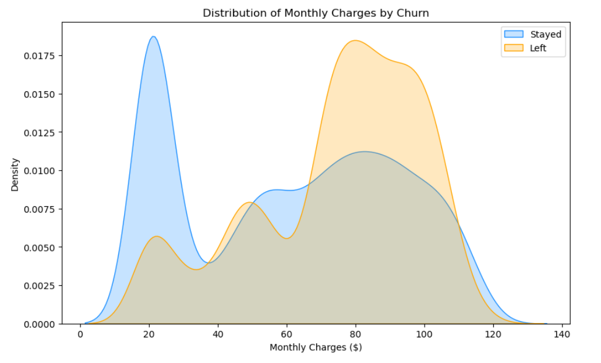

# Telco Customer Churn Analysis

### 🎯 Project Overview
This project analyzes a dataset of 7,000+ customers to identify key drivers of churn. The goal is to provide actionable insights to the retention team to reduce customer loss.

### 🛠️ Tech Stack
- **Python** (Pandas, Matplotlib, Seaborn)
- **Jupyter Notebook** for Exploratory Data Analysis (EDA)

### 📈 Key Insights
1. **Contract Risk:** Month-to-month customers are **4x more likely to churn** than those on yearly contracts. 
   * *Recommendation:* Offer a discount for switching to a 1-year plan.
2. **Pricing Sensitivity:** Churn peaks at the **$70-$100/month** range. High-paying customers are leaving at a higher rate.
   * *Recommendation:* Audit the service quality for high-tier plans.

### 📊 Visualizations

*Figure 1: Comparison of churn rates across contract types.*

*Figure 2: Density plot showing churn peaks at higher price points.*

### 📂 How to Use
1. Clone this repo.
2. Run `pip install -r requirements.txt`.
3. Open `analysis.ipynb` to view the full cleaning and visualization process.
